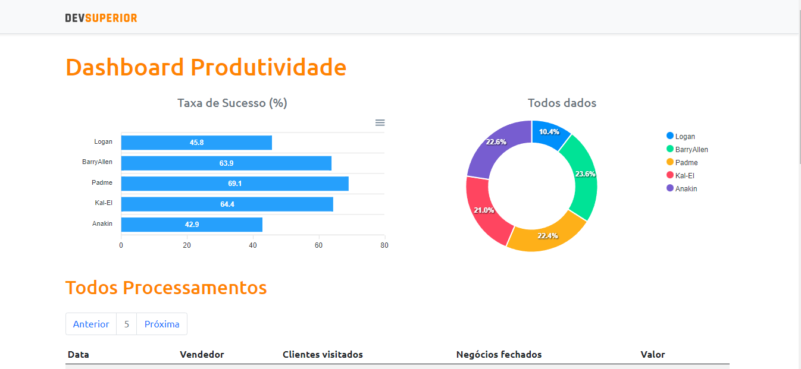

#  Dashboard Produtividade

##  Semana Spring React - SDS 4.0

>  *Criação de uma aplicação com uso das tecnologias em alta demanda no mercado*

## Realização
[DevSuperior - Escola de programação](https://devsuperior.com.br)

## Tecnologias:
- 
- 
- 
- 

## Ferramentas Utilizadas:

- JDK 11
- STS
- Postman
- Postgresql 12 e pgAdmin
- Heroku CLI
- NPM
- VS Code
- Git

## Biblioteca para Estilização:

# Projeto feito com Create React App

Esse projeto foi criado com [Create React App](https://github.com/facebook/create-react-app).

## Scripts Disponíveis

No diretório do projeto, você pode executar:

### `yarn start`

Executa o aplicativo no modo de desenvolvimento. \
Abra [http: // localhost: 3000] (http: // localhost: 3000) para visualizá-lo no navegador.

A página será recarregada se você fizer edições. \
Você também verá quaisquer erros de lint no console.

### `yarn test`

Inicia o executor de teste no modo de observação interativo. \
Consulte a seção sobre [testes em execução] (https://facebook.github.io/create-react-app/docs/running-tests) para obter mais informações.

### `yarn build`

Compila o aplicativo para produção na pasta `build`. \
Ele agrupa corretamente o React no modo de produção e otimiza a construção para o melhor desempenho.

A compilação é reduzida e os nomes dos arquivos incluem os hashes. \
Seu aplicativo está pronto para ser implantado!

Consulte a seção sobre [implantação] (https://facebook.github.io/create-react-app/docs/deployment) para obter mais informações.

### `yarn eject`

**Nota: esta é uma operação unilateral. Depois de `ejetar`, você não pode mais voltar!**

# Hospedado em:
